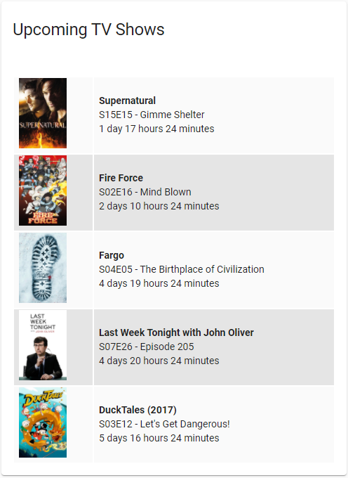

Medusa Upcoming TV Shows
============
A Home Assistant sensor that pulls the latest upcoming TV shows from Medusa. This is a fork of Youdroid's [SickChill Wanted Tv Shows](https://github.com/youdroid/home-assistant-sickchill) with a few fixes such as compability with the awesome [Flex Table](https://github.com/custom-cards/flex-table-card) and better airdate handling. The sensor should work with any Sick* fork (SickChill, SickRage, etc.).

## Installation using HACS (Recommended)
1. Navigate to HACS and add a custom repository  
    **URL:** https://github.com/IDmedia/hass-medusa  
    **Category:** Integration
2. Install module as usual
3. Restart Home Assistant

## Configuration
The sensor is compatible with [Upcoming Media Card](https://github.com/custom-cards/upcoming-media-card) and [Flex Table](https://github.com/custom-cards/flex-table-card) so you may install either depending on your preferences.

| Key | Default | Required | Description
| --- | --- | --- | ---
| token | | yes | Your Medusa token (Config > General > Interface > API Key > Generate)
| name | medusa | no | Name of the sensor.
| host | localhost | no | The host which Medusa is running on.
| port | 8081 | no | The port which Medusa is running on.
| protocol | http | no | The HTTP protocol used by Medusa.
| sort | name | no | Parameter to sort TV Shows **[date, name]**
| webroot |  | no | WebRoot parameter if you change it in config.ini (Syntax : **/newWebRoot**)

## Example
  
Add the following to your `configuration.yaml`:
```
sensor:
  - platform: medusa
    name: medusa
    host: !secret medusa_host
    token: !secret medusa_token
    sort: date
```

Add the following to your `lovelace.yaml`:
```
- type: 'custom:flex-table-card'
  title: Upcoming TV Shows
  clickable: false
  max_rows: 5
  strict: true
  entities:
    include: sensor.medusa
  columns:
    - data: data
      name: ' '
      modify: >-
        x.poster ? '' : 
                   '';
    - data: data
      name: ' '
      modify: >-
        const hourDiff = (Date.parse(x.airdate) - Date.now());
        const secDiff = hourDiff / 1000;
        const minDiff = hourDiff / 60 / 1000;
        const hDiff = hourDiff / 3600 / 1000;
        const dDiff = hourDiff / 3600 / 1000 / 24;
        const days = Math.floor(dDiff);
        const hours = Math.floor(hDiff - (days * 24));
        const minutes = Math.floor(minDiff - 60 * Math.floor(hDiff));
        const tdays = (Math.abs(days) > 1) ? days + " days " : ((Math.abs(days) == 1) ? days + " day " : "");
        const thours = (Math.abs(hours) > 1) ? hours + " hours " : ((Math.abs(hours) == 1) ? hours + " hour " : "");
        const tminutes = (Math.abs(minutes) > 1) ? minutes + " minutes " : ((Math.abs(minutes) == 1) ? minutes + " minute " : "");
        const episodeNumber = x.number ? x.number : '';
        const episodeTitle = x.episode ? x.episode : '';
        const title = x.title ? x.title : '';
        const subTitle = [episodeNumber, episodeTitle].filter(Boolean).join(" - ");
        const timeLeft = (hourDiff > 0) ? tdays + thours + tminutes : '<span style="color:red;font-weight:bold;">Not downloaded yet</span>';
        
        if (title) {
          "<b>" + title + "</b><br />" + 
          subTitle + "<br />" +
          timeLeft
        } else {
          null;
        }
```
